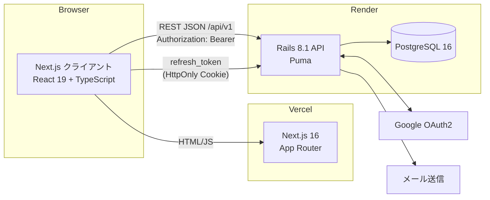

# Architecture — Otter Bank

> システム構成・データの流れ・技術選定の理由をまとめる。
> 「何を作るか」は [PRD.md](./PRD.md)、コーディング規約は `.claude/rules/*.md` を参照。

最終更新: 2026-09-26

---

## 1. 全体像



- **モノレポ**: `front/`（Next.js）と `back/`（Rails API）の 2 アプリ。ルートの `package.json` は husky + lint-staged のみ
- **通信**: ブラウザから Rails API へ直接 `fetch`（CORS 許可）。URL は `getApiUrl()`（`front/src/lib/api-client.ts`）が環境変数から決定
- **デプロイ**: フロント = Vercel / バック + DB = Render（`render.yaml`）
- **ローカル**: `compose.yml` で front(4000) / back(3000) / db(5433) を起動

## 2. ディレクトリ構成

```
Otter_Bank/
├── front/                     Next.js 16 (App Router)
│   └── src/
│       ├── app/<route>/       ページ。専用コンポーネントは _components/ に置く
│       ├── components/        複数ページで共有するコンポーネント
│       │   └── ui/            shadcn/ui（Radix ベース）
│       ├── hooks/             useAuth, useAchievements
│       ├── lib/               api-client.ts（fetch ラッパー）/ api.ts（エンドポイント定義）/ schemas（zod）
│       └── types/             API 型とフロント内部型
├── back/                      Rails 8.1 API モード
│   ├── app/controllers/api/v1/   REST コントローラー
│   ├── app/controllers/concerns/ ExceptionHandler, PostLookup, AchievementJson
│   ├── app/models/
│   ├── app/services/          AchievementService, JsonWebToken
│   ├── app/mailers/           パスワードリセット・問い合わせ確認
│   └── spec/                  RSpec（request / model / concern）
├── docs/                      PRD・アーキテクチャ・デザインシステム・ER 図
├── .claude/                   Claude Code 用ルール・エージェント・タスク
├── .codex/                    Codex 用エージェント
└── .github/workflows/ci.yml   CI
```

## 3. フロントエンド

| 関心事 | 採用技術 | 備考 |
|---|---|---|
| フレームワーク | Next.js 16 App Router | 現状ほぼ全ページが `"use client"`。SSR/RSC はほぼ未活用 |
| UI | shadcn/ui + Radix UI + Tailwind CSS 4 | トークンは `globals.css`。詳細は DESIGN-SYSTEM.md |
| フォーム | react-hook-form + zod | スキーマは `src/lib/schemas` |
| グラフ | recharts | `next/dynamic({ ssr: false })` で遅延ロード |
| 通知 | sonner | |
| テーマ | next-themes | `class` 戦略でライト/ダーク |
| テスト | Jest + Testing Library | `__tests__/` 配下 |

**API 呼び出しの流れ**: ページ → `api.ts` の関数 → `apiRequest()`（`api-client.ts`）→ `fetch`。
`res.ok` 判定・エラー整形（`api-error.ts`）はこの層に集約する。

**認証状態**: `useAuth` が一元管理。アクセストークンは `localStorage`、リフレッシュトークンは HttpOnly Cookie。
トークン検証で `token_expired` が返ったら `refreshAccessToken()` で 1 回だけ更新を試みる（リフレッシュトークンは使い捨てなので、同時に期限切れを検知しても in-flight の Promise を共有して 1 回に抑える）。

## 4. バックエンド

### 4.1 リクエスト処理

```
Rack::Attack（レート制限）→ Rack::Cors → ApplicationController#authorize_request
  → 各コントローラー（current_api_v1_user でスコープ）
  → 副作用は AchievementService へ（begin/rescue で本体処理から隔離）
  → インラインの *_json メソッドで JSON を組み立てて render
  ↳ 例外は ExceptionHandler concern が rescue_from で日本語エラーに変換
```

### 4.2 認証

| 項目 | 仕様 |
|---|---|
| アクセストークン | JWT（HS256）、payload は `user_id` のみ、有効期限 30 分、`Authorization: Bearer` |
| リフレッシュトークン | ランダム値のダイジェストを `refresh_tokens` に保存、14 日、HttpOnly Cookie。使用時に行ロック → 失効 → 再発行（ローテーション） |
| Google ログイン | OmniAuth → `/auth/google/callback` → `oauth_providers(provider, uid)` でユーザーと紐付け |
| ゲスト | `POST /guest_sessions` で共有ゲストユーザーのトークンを発行 |
| 公開エンドポイント | `skip_authorization?` で明示（GET 系と登録・ログインのみ） |

### 4.3 主要エンドポイント

| 領域 | エンドポイント |
|---|---|
| 認証 | `POST /users` `GET/PATCH/DELETE /user` `POST/DELETE /sessions` `POST /guest_sessions` `GET /auth/verify` `POST /auth/refresh` `GET /auth/google(/callback)` `POST /auth/reset-password(/confirm)` |
| 家計 | `/transactions` `/savings_goals` `/budgets`（+ `GET /budgets/current`）`/achievements` |
| 掲示板 | `/posts`（+ `increment_views` `like` `unlike`）`/posts/:id/comments`（+ `like` `unlike`）`/posts/:id/bookmark` |
| その他 | `POST /contacts` `GET /health` |

すべて `/api/v1` 配下。正確な一覧は `bin/rails routes` を正とする。

### 4.4 データモデル

ER 図: [ER.drawio.png](./ER.drawio.png)

```
users ─┬─< transactions        (transaction_type: 'income' | 'expense' の string 列)
       ├─< budgets             (year, month ごとの予算額)
       ├─< savings_goals
       ├─< achievements        (category / tier は integer enum)
       ├─< refresh_tokens
       ├─< oauth_providers     (provider, uid)
       ├─< posts ─┬─< comments
       │          ├─< post_categories >── categories
       │          └─< bookmarks
       ├─< likes               (likeable: Post | Comment のポリモーフィック)
       └─< user_actions        (※現状未使用。§6 参照)
contacts                       (ユーザーと非連携)
```

- `likes_count` / `comments_count` / `views_count` はカウンターキャッシュ
- 集計・ストリーク計算は `transactions.date` 基準（`created_at` は使わない）

### 4.5 実績システム

`AchievementService`（`back/app/services/achievement_service.rb`）が唯一の窓口。

1. ユーザー作成時に 20 件の実績レコードを作成（`original_achievement_id` で種類を識別）
2. 取引作成・投稿作成・いいね獲得などのコントローラーから `AchievementService.new(user).<イベント>` を呼ぶ
3. 進捗更新で `progress >= progress_target` になったら解除し、レスポンスの `newly_unlocked_achievements` で返す
4. フロントは解除モーダルを表示

実績の定義は現状サービス内のハードコード。ID を追加したら同ファイル内の全 `case` 分岐に反映すること。

## 5. 品質・運用

| 項目 | 内容 |
|---|---|
| CI（GitHub Actions） | back: Brakeman / RuboCop / RSpec（PostgreSQL サービス）、front: ESLint / tsc / Jest / next build |
| pre-commit | husky + lint-staged（RuboCop・ESLint --fix） |
| 依存更新 | Dependabot |
| レート制限 | `login/ip` 5回/分、`signup/ip` 10回/時、`password_reset/ip` 5回/時、`contact/ip` 3回/時、`OAuth/ip` 10回/分 |
| 監視 | `GET /api/v1/health`、`GET /up` のみ（エラートラッキングなし） |

---

## 6. 技術選定の評価（ADR-001: バックエンドを Rails のまま維持する）

**ステータス**: 採用（2026-09-26）

### 問い

フロントが TypeScript なので、バックエンドも TypeScript（Next.js 一体型 / Hono / NestJS など）に変えるべきか。

### 検討した選択肢

| 選択肢 | 良い点 | 悪い点 |
|---|---|---|
| **A. Rails API を維持**（採用） | 動いていてテストもある。認証・レート制限・メール・マイグレーションが揃っている。規約（`.claude/rules`）も Rails 前提で蓄積済み | 言語が 2 つ。フロントと型を共有できない。Render 無料プランのコールドスタート |
| B. Next.js に統合（Route Handlers + Prisma/Drizzle + Auth.js） | 1 言語・1 デプロイ・型共有。CORS 不要 | 認証・リフレッシュ・レート制限・実績・メール・全テストの作り直し。Vercel の関数実行時間や DB 接続数の考慮が必要 |
| C. TS の独立 API（Hono / NestJS） | 1 言語で型共有しつつ API を分離できる | B と同じく全面書き直し。Rails より「自分で組む」部分が多い |
| D. Go / Python 等 | 性能・学習目的 | このアプリの規模では性能は課題でなく、得るものが少ない |

### 判断理由

- **ボトルネックは言語ではない**。API はコントローラー合計 約 1,500 行の CRUD 中心で、Rails が最も得意な領域
- 書き直しのコスト（認証まわりの安全性の再検証を含む）に対して、ユーザーが得る価値がない
- 実際の UX 課題は **コールドスタート** と **フロントの巨大ページ**（`dashboard/page.tsx` 730 行、`board/page.tsx` 573 行）であり、言語変更では解決しない
- 型共有の欲求は、OpenAPI スキーマ → TS 型生成で Rails のまま満たせる

### 見直す条件

- リアルタイム機能・SSR でのデータ取得を本格化し、フロントと API の境界を減らしたくなったとき → B を再検討
- 開発者が増え、Ruby を書ける人がいなくなったとき

### 維持する代わりにやること（スリム化）

「今のフレームワークは必要か / 余計な機能は」への回答。Rails 自体は必要だが、読み込んでいて使っていない部分がある。

| 対象 | 現状 | 推奨 |
|---|---|---|
| `require 'rails/all'` | Action Cable / Active Storage / Action Text / Action Mailbox も読み込む（いずれも未使用） | 必要なフレームワークだけを個別 `require` する（active_record / action_controller / action_mailer / active_job）。`app/channels/` と active_storage 設定を削除 |
| Active Job | アダプタ未指定（プロセス内 `:async`）。再起動でメール送信ジョブが消える | `solid_queue` を入れるか、送信件数が少ない今は `deliver_now` にする |
| `user_actions` テーブル | モデルと関連のみで書き込み箇所なし | 使う予定がなければ削除 |
| `oauth_providers.access_token / refresh_token / expires_at` | 保存していない（保存すべきでもない） | 列を削除 |
| ルートの `Gemfile.lock` | Rails 8.0.1 時代の残骸（`back/Gemfile.lock` が本物） | 削除 |
| `front/tailwind.config.ts` と `tailwindcss-animate` | Tailwind 4 では `@config` がないため読み込まれていない。アニメーションは `tw-animate-css` が担当 | 削除（トークンは `globals.css` の `@theme` に一本化） |
| `@shadcn/ui`（devDependency） | 旧 CLI パッケージ。コードからは未参照 | 削除（コンポーネント追加は `npx shadcn@latest add`） |
| `eslint-config-next@15` | `next@16` とメジャーがずれている | 16 系に揃える |
| `next.config.ts` の `rewrites` | フロントは API を直接叩いているため未使用の経路 | 使わないなら削除（残すならどちらかに統一） |

### 優先度の高い改善（言語変更より効果が大きいもの）

1. **コールドスタート対策**: Render の有料プラン化、または Fly.io 等スリープしない環境へ移す。最低限、フロントで「サーバー起動中」の表示を出す
2. **巨大ページの分割**: `dashboard` / `board` を `_components/` に分割し、データ取得をカスタムフックへ
3. **API の型共有**: `rswag` 等で OpenAPI を出力し `openapi-typescript` で `front/src/types` を生成
4. **エラートラッキング**: Sentry 等（無料枠）を front/back に導入
5. **ゲストの個別化**: PRD §9 参照
